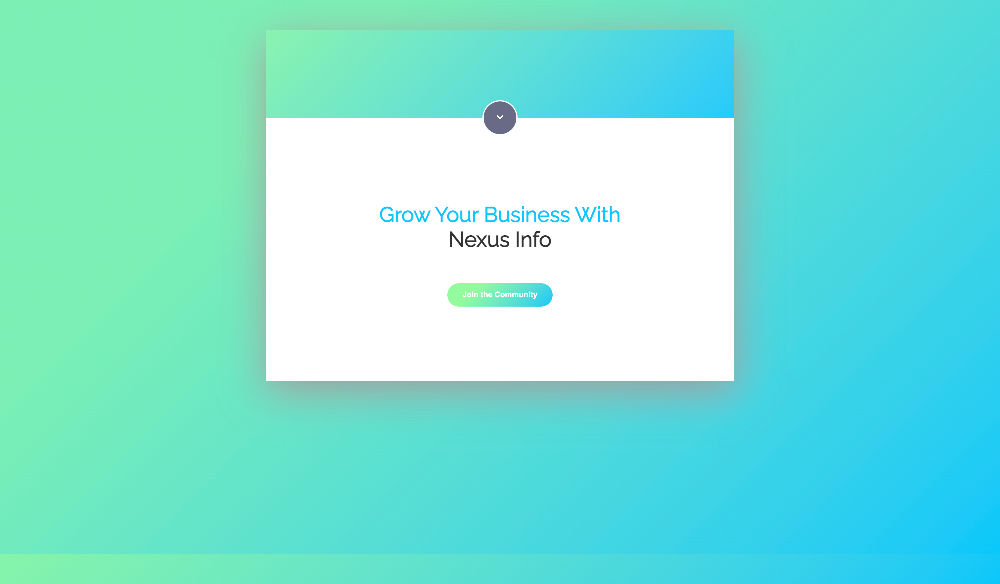
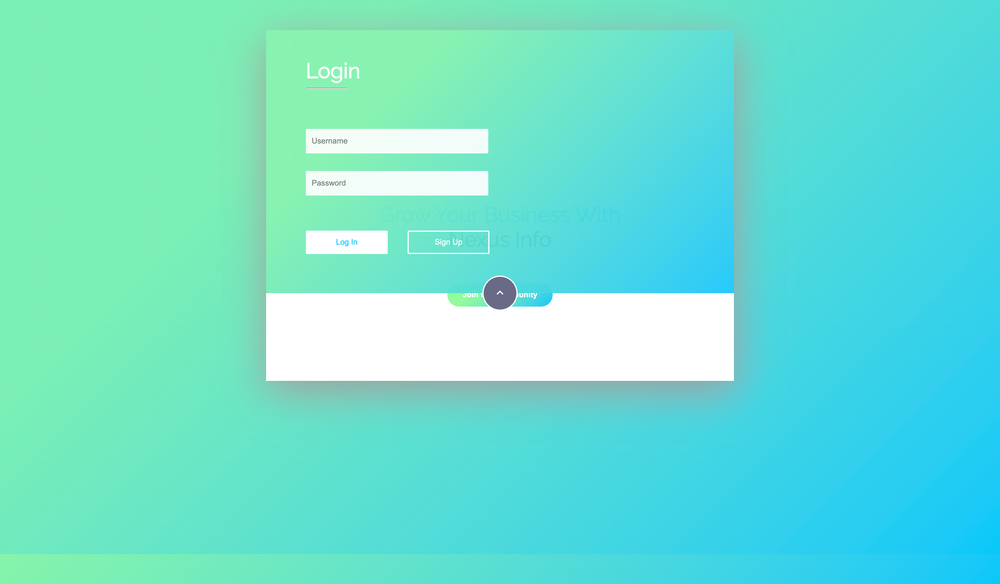
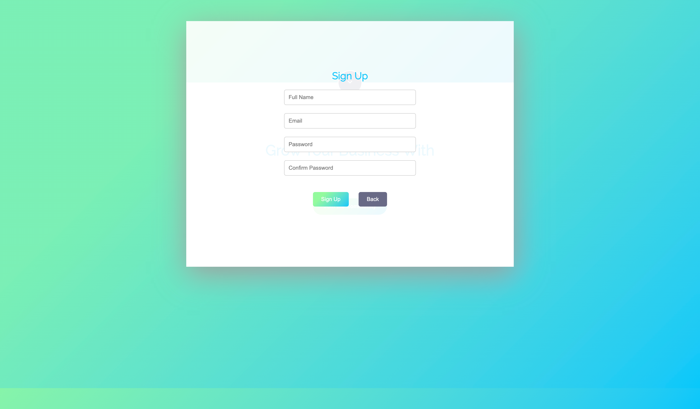

# Nexus Info Website

This repository contains the code for the Nexus Info website, designed to help grow your business with a modern and responsive design. The website includes a login section, a call-to-action area, and a sign-up form with basic validation.

## Features

- **Responsive Design:** The website is fully responsive, ensuring a great user experience on all devices.
- **Modern Color Scheme:** Uses a modern gradient color scheme with `#09c7fb` and `#93fb9d`.
- **Blurred Background Effect:** The background has a stylish blur effect to enhance visual appeal.
- **Sign-Up Form:** Includes a sign-up form with basic validation and error message display.

## Preview

## Technologies Used

- **HTML5**
- **CSS3**
- **JavaScript**
- **Font Awesome (for icons)**

